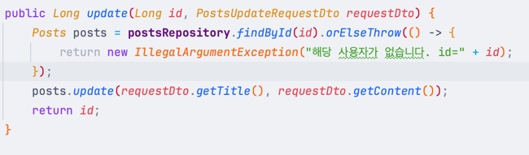

코드 한줄이 한페이지에 다 들어오지 않는다면 줄바꿈과 들여쓰기를 적당히 섞어서 한 페이지에 다 나오게 해주는 것이 좋다고 생각합니다. 
메소드 체이닝중이라면다음 메소드를 `.`과 함께 통째로 `.orElseThrow()` 줄바꿈합니다.
체이닝중에 람다식을 써야하는데 너무 길다면 욕심을 버리고
`{}`중괄호를 열고 `return`을 적는것도 좋은 방법인것 같습니다!

```java
@RequiredArgsConstructor
@Service
public class PostsService {
    private final PostsRepository postsRepository;
    
    // ...
    public Long update(Long id, PostsUpdateRequestDto requestDto) {
      Posts posts = postsRepository.findById(id).orElseThrow(() -> {
        return new IllegalArgumentException("해당 사용자가 없습니다. id=" + id);
      });
      posts.update(requestDto.getTitle(), requestDto.getContent());
      return id;
    }

}
```

