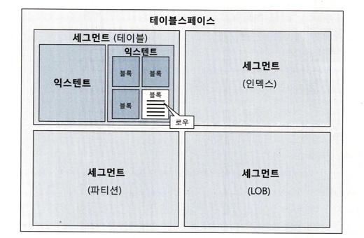
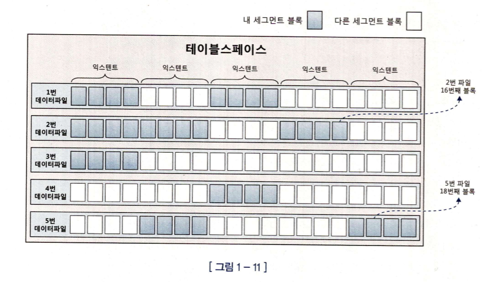

# SQL 파싱과 최적화
DBMS는 SQL을 어떻게 처리하는 걸까? 🤔

### SQL은 구조적, 집합적, 선언적인 언어다.
1. 구조적 ( Structured )
  - 영어와 문법이 같기 때문에 `구조적이다`라는 말이 붙었습니다.
2. 집합적 ( Set Based )
  - 명령문 실행의 결과로 집합( 데이터 뭉치 )를 줍니다.
3. 선언적 ( Declarative )
  - Declarative란 원하는 결과를 얻기 위해 ‘어떤’ 것이 필요한지만 정의(‘어떻게’ 하는지는 신경쓰지 않고)하는 코드라고 할 수 있습니다. 
  - [참고](https://medium.com/@su_bak/term-imperative-programming-vs-declarative-programming-b5a1b6ce3170)

### SQL 최적화
DBMS 내부에서 옵티마이저가 프로시저를 만드는 과정입니다.

# 데이터 저장 구조 및 I/O 매커니즘

### 데이터베이스 저장 구조

1. 테이블스페이스
   - 세그먼트를 담는 컨테이너 
   - 여러개의 데이터파일(디스크 상의 물리적인 OS파일)로 구성.
2. 세그먼트
   - 테이블, 인덱스 등 데이터 저장공간이 필요한 오브젝트.
3. 익스텐트
   - 공간을 확장하는 단위.
   - 하나의 익스텐트는 하나의 테이블이 독점
4. 블록
   - 데이터베이스의 최소 단위
   - 레코드가 저장되는 단위

세그먼트에 할당된 익스텐트는 여러개의 데이터파일에 분포되어 있다.
파일 경합을 줄이기 위해서다.

### 캐시 탐색 메커니즘

Direct path i/o 를 제외한 모든 블록 i/o는 메모리 버퍼 캐시를 경유한다.
- 인덱스 루트 블록을 읽을 때
- 인덱스 루트 블록에서 얻은 주소 정보로 브랜치 블록을 읽을 때
- 브랜치 블록에서 얻은 주소 정보로 리프 블록을 읽을 때
- 리프 블록에서 데이터 블록을 읽을 때
- 테이블 블록을 Full Scan 할 때

### Cache Buffer Chain Lock 
