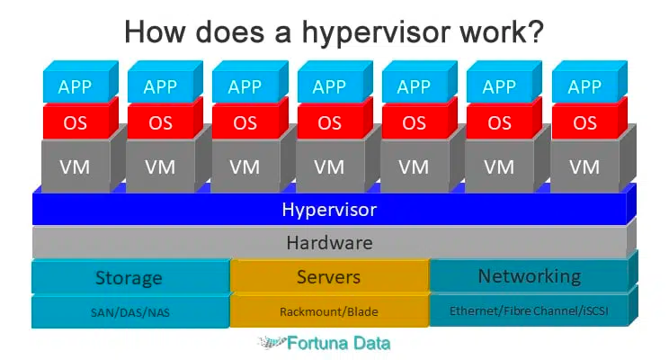
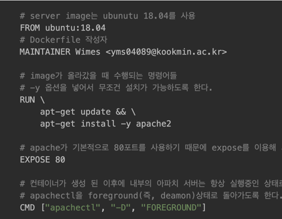
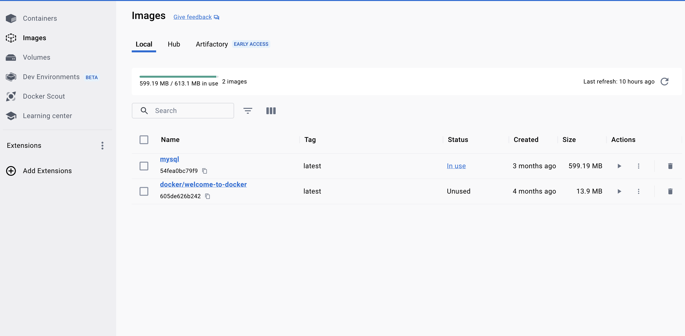
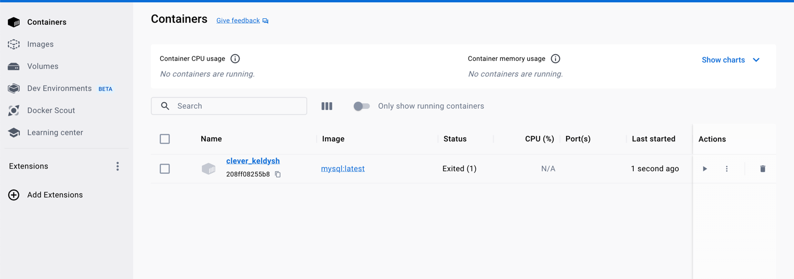

# 1. 클라우드와 가상머신
클라우드를 배우기 전, 클라우드의 근본이 되는 **가상머신**을 먼저 공부합니다.

### 가상머신이 있기 전
PC 하나에 OS 하나로 여러 사용자가 사용합니다.
하지만 어떤 프로그램을 수행했을때 전체에 영향을 미치게 됩니다.

### 가상머신이 생긴 후
PC의 하드웨어를 소프트웨어적으로 구현한 것입니다.
PC 하나에 OS 여러개, CPU와 RAM도 OS마다 분배할 수 있어서 독립적입니다.

# 2. on-premises, off-premises

### off-premiss
클라우드를 다른 회사의 것을 사용하는 것을 말합니다.

### on-premiss
네트워크 선을 배치하는 것부터 시작해서 서버, DB등 필요한 모든 프로그램을 설치하는 것을 말합니다.

# 3. IaaS, PaaS, SaaS

### IaaS ( Infra As A Service )
클라우드는 단지 인프라만 제공합니다.
필요한 애플리케이션은 본인이 설치해야 합니다.
ex) AWS ec2

### PaaS ( Platform As A Service )
클라우드가 플랫폼을 제공합니다.
필요한 애플리케이션들이 설치 되어 있고 모니터링과 CI/CD를 제공합니다.
ex) heroku

### SaaS ( Software As A Service )
애플리케이션 자체를 제공합니다.
마이크로소프트의 office365나 Google docs가 대표적입니다.

# 4. 컨테이너와 도커

### 컨테이너
개발 후 서버를 옮겨야겠단 생각에 개발에 필요한 프로그램들을 다른 서버로 옮기려고 한다.
이때 각각의 프로그램의 버전이나 데이터들을 모아둔 것이 컨테이너입니다.
컨테이너들은 OS를 공유합니다. OS가 차지하는 용량이 없어지기 때문에 좀 더 빠르고 가볍습니다.

### 도커
컨테이너를 만들 수 있는 가장 대중적인 플랫폼입니다.

### 도커를 이용하는 과정
1. 도커파일
   - 애플리케이션의 버전, 이미지 실행시 수행되어야 할 명령어, 필요한 변수 등등 이미지를 정의하는 파일입니다.
   - 빌드 후 도커 이미지가 됩니다.
   - 
2. 도커이미지
   - 하나, 혹은 여러개의 애플리케이션 정보들이 들어있습니다.
   - 
3. 도커컨테이너 
   - 도커이미지를 실행시키면 도커컨테이너가 됩니다
   - 

