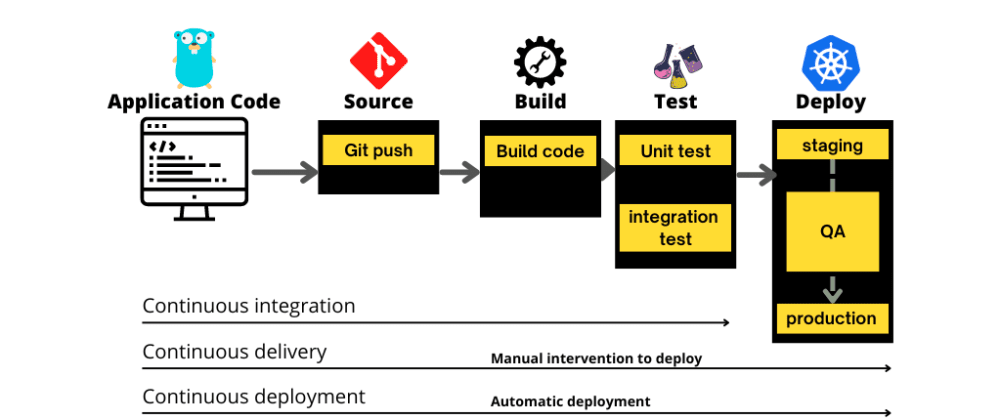

### 파이프라인
코드부터 배포까지 일련의 과정을 CI/CD **Pipe Line**이라고 합니다.

1. Continuous Integration
  - 코드를 빌드하고 테스트하고 합칩니다.
2. Continuous Delivery
   - 해당 레퍼지토리에 릴리즈합니다.
   - 코드를 메인 브랜치까지 올린게 됩니다.
3. Continuous Deployment
   - 실제 서비스에 배포합니다.

### 왜 단계를 나눴을까요?
체계적으로 배포를 관리 함으로써 문제 발생의 원인을 빠르게 찾을 수 있습니다.
테스트를 강제할 수 있습니다.
테스트가 없으면 머지가 되지 않기 때문입니다.

### 테스트의 종류
1. 단위 테스트
  - 함수 같은 작은 단위를 테스트
2. 통합 테스트
  - 모듈을 통합할 때 하는 테스트
3. 엔드 투 엔드 테스트
  - 사용자가 서비스를 사용하는 상황을 가정해서 테스트

### CI/CD Tools
github action, jenkins, circle ci 등이 있습니다.
