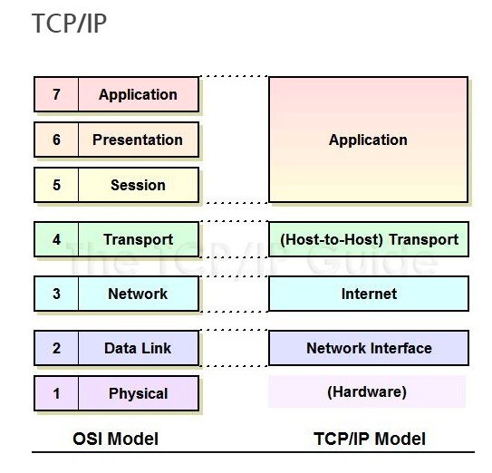

---

title:  "[CS 지식의 정석] TCP IP 4계층 "
categories:
  cs-knowledge
tags:
  - [cs-knowledge]

toc: true
toc_sticky: true

breadcrumbs: true

date: 2023-10-14
last_modified_at: 2023-10-14
---

### 데이터 통신 프로토콜이 왜 생겼을까?
데이터를 전송할 때 필요한 여러가지들이 있습니다.
나의 주소, 상대방의 주소, 데이터를 보냈을 때 오류를 확인하는 방법 등등
이 과정을 레이어로 체계화 해놓고 약속한 것이 데이터 통신 프로토콜이고 그중에 유명한 것이 `OSI 7 Layer` , `TCP/IP 4 Layer`입니다.

### TCP/IP의 개념
TCP/IP 4계층은 장치들이 인터넷 상에서 데이터를 주고받을 때 쓰는 프로토콜입니다.
TCP(Transmission Control Protocol)
IP(Internet Protocol)
인터넷을 통해 데이터를 보낼 때 주로 TCP/IP를 사용하기 때문에 이름이 **TCP/IP 4 계층**입니다.

1. Application 
   - 사용자가 사용하는 애플리케이션입니다.
   - ex) http, sftp, ftp, smtp, ssh
2. Transport 
   - Application으로부터 데이터를 받아 세그먼트 혹은 데이터그램 단위로 데이터를 쪼개고 오류없이 순서대록 전달되도록 합니다.
   - 오류체크
   - ex) TCP, UDP
3. Internet
   - 노드에서 다른 노드로 Transport로부터 받은 쪼개진 데이터를 패킷으로 만들어 전송합니다.
   - 주소전달
   - ex) IP, ICMP, ARP 
4. Network Access (Link)

### 캡슐화
송신자가 수신자에게 데이터를 보낼 때 데이터에 각 계층이 헤더를 붙이는 겁니다.
전송계층은 tcp 헤더, 네트워크 계층은 ip 주소 헤더

### 역캡슐화
수신자가 캡슐화된 데이터를 역순으로 제거하면서 응용계층까지 보내는걸 말합니다

### PDU (Protocol Data Unit)
tcp/ip 4계층을 기반으로 각 계층의 데이터 단위를 의미합니다.
- 애플리케이션 계층 : 메세지
- 전송 계층 : 세그먼트(tcp), 데이터그램(udp)
- 인터넷 계층 : 패킷
- 링크 계층 : 프레임(데이터 링크 계층), 비트(물리 계층)

### 세그먼트(데이터그램)
데이터를 적절한 크기로 쪼갠 조각입니다.

### 패킷
세그먼트에 Source Ip (출발지 ip), Destination Ip (도착지 ip)가 추가 됐습니다.

### 프레임
Mac 주소 헤더와 CRC/Checksum trailer가 추가 됐습니다.

### CRC/Checksum Trailer
데이터의 오류감지를 위한 수학적 함수가 적용된 값입니다.
데이터 손상을 감지할 수 있습니다.

### OSI 와의 차이점

# MTU와 MSS와 PMTUD

### MTU(Maximum Transmission Unit)
데이터를 쪼개놓은 패킷은 쪼개지는 기준이 있습니다.
바로 `MTU`라고 합니다. 네트워크 통신할 수 있는 가장 큰 PDU를 말합니다.
통신을 하는 송신자 수신자 제외하고 경로상의 모든 장치들의 MTU도 고려해야합니다.
MTU보다 패킷이 더 클때 분할을 할 때가 있고 분할을 하지 않을때가 있습니다.
IPv6는 분할을 하지 않고 IPv4는 분할합니다.
Ip 헤더에 Flag를 통해 알 수 있습니다.

### MSS(Maximum Segment Size)
TCP에서 사용할 수 있는 크기로 TCP헤더, IP 헤더를 뺀 크기입니다.
그러므로 MTU보단 조금 더 작습니다.
일반적으로 MTU는 1500, MSS는 1460 정도이고 그렇기 때문에 데이터는 보통 1460이하로 합니다.

### PMTUD(Path MTU Discovery)
수신자와 송신자의 경로 상에서 장치가 패킷을 누락한 경우 테스트 패킷을 MTU에 맞게끔 반복해서 보내는 과정입니다.

# Application Layer

