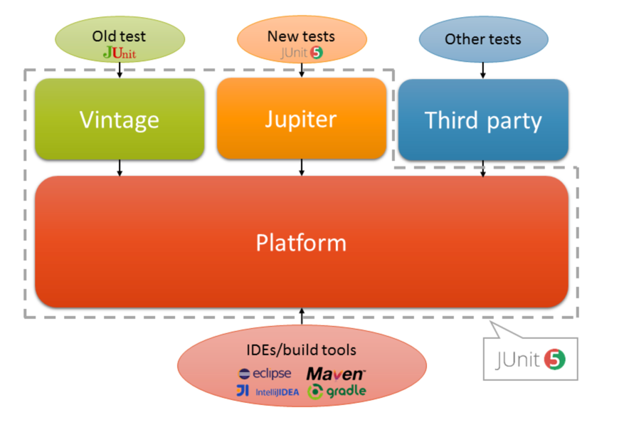

# Junit5 소개



- Junit5는 Junit4와는 다르게 3가지 모듈로 나뉘어져 있습니다.
  - Junit Platform : 테스트를 실행하는 런처와 테스트 엔진 API를 제공.
    - 런처 : 테스트를 실행하는 역할.
    - 테스트 엔진 API : 테스트를 실행하는 엔진을 제공.
  - Junit Jupiter : Junit5에서 사용하는 테스트 API를 제공.
  - Junit Vintage : Junit4와 Junit3을 실행할 수 있도록 지원.

- Junit5 부터는 테스트가 굳이 public일 필요가 없습니다.

### BeforeAll, AfterAll, BeforeEach, AfterEach

- BeforeAll : 모든 테스트가 실행되기 전에 딱 한번 실행됩니다.
- AfterAll : 모든 테스트가 실행된 후에 한번 실행됩니다.
- BeforeEach : 각 테스트가 실행되기 전에 실행됩니다.
- AfterEach : 각 테스트가 실행된 후에 실행됩니다.

```java
@DisplayNameGeneration(DisplayNameGenerator.ReplaceUnderscores.class)
class StudyTest {

  @Test
  void test1_underscore_replaced_by_blank() {
    Study study = new Study(10);
    assertAll(
      () -> assertEquals(StudyStatus.DRAFT, study.getStatus(), () -> "스터디를 처음 만들면 상태값이 DRAFT 여야 한다."),
      () -> assertSame(StudyStatus.DRAFT, study.getStatus(), () -> "스터디를 처음 만들면 상태값이 DRAFT 여야 한다."),
      () -> assertTrue(study.getLimit() > 0, () -> "스터디 최대 참석 인원은 0보다 커야 한다.")
    );
    assertThrows(IllegalArgumentException.class, () -> new Study(-10));
  }

  @Test
  @DisplayName("테스트 - 2 입니다. 🥰")
  void test2() {
    assertTimeout(Duration.ofMillis(100), () -> {
      new Study(10);
      //Thread.sleep(300); // 100ms 보다 300ms가 걸리면 에러 발생
    });

    // preemptively : 100ms가 지나면 즉각 중단
    assertTimeoutPreemptively(Duration.ofMillis(100), () -> {
      new Study(10);
      //Thread.sleep(300);
    });
    System.out.println("test2");
    // ThreadLocal 사용 시 주의 : spring transaction 의 경우 ThreadLocal이 기본인데 이 경우 쓰레드 간에 공유되지 않는다.
    // 즉 transaction 이 제대로 적용이 안될 수도 있다. rollback 이 안되고 db에 반영이 될 수도 있다.
  }

  @BeforeAll
  static void beforeAll() {
    System.out.println("before all");
  }

  @AfterAll
  static void afterAll() {
    System.out.println("after all");
  }

  @BeforeEach
  void beforeEach() {
    System.out.println("before each");
  }

  @AfterEach
  void afterEach() {
    System.out.println("after each");
  }

}
```
