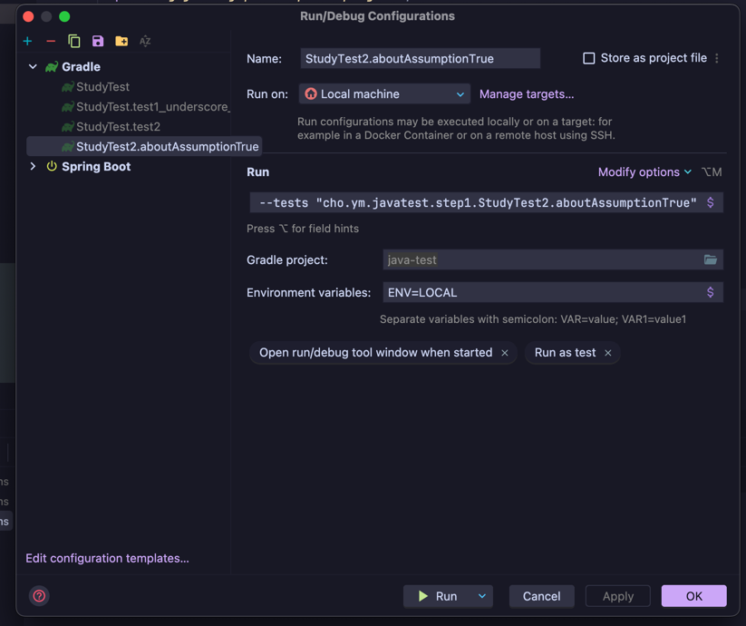

# Junit5 Assertions
> Junit5에서 제공하는 다양한 Assertion을 사용해보자.
```java
class StudyTest1 {
  @Test
  void test1_underscore_replaced_by_blank() {
    Study study = new Study(10);
    assertAll(
      () -> assertEquals(StudyStatus.DRAFT, study.getStatus(), () -> "스터디를 처음 만들면 상태값이 DRAFT 여야 한다."),
      () -> assertSame(StudyStatus.DRAFT, study.getStatus(), () -> "스터디를 처음 만들면 상태값이 DRAFT 여야 한다."),
      () -> assertTrue(study.getLimit() > 0, () -> "스터디 최대 참석 인원은 0보다 커야 한다.")
    );
    assertThrows(IllegalArgumentException.class, () -> new Study(-10));
  }
}
```
# Junit5 Assumptions
> 조건에 따라 테스트 실행하기
```java
class StudyTest2 {

    private final Study study = new Study(10);

    @Test
    @DisplayName("assumeTrue 테스트")
    void aboutAssumptionTrue() {
        assumeTrue("LOCAL".equalsIgnoreCase(System.getenv("ENV")));
        System.out.println("assumeTrue test");

    }

    @Test
    void aboutAssumingThat(){
        String env = System.getenv("ENV");

        assumingThat("LOCAL".equalsIgnoreCase(env), () -> {
            System.out.println("LOCAL");
            Study actual = new Study(100);
            assertEquals(StudyStatus.DRAFT, actual.getStatus());
        });

        assumingThat("PROD".equalsIgnoreCase(env), () -> {
            System.out.println("PROD");
            Study actual = new Study(10);
            assertEquals(StudyStatus.DRAFT, actual.getStatus());
        });
    }

    @EnabledIfEnvironmentVariable(named = "ENV", matches = "LOCAL")
    @Test
    void aboutEnableEnviromentVariable(){
        System.out.println("aboutEnableEnviromentVariable");
    }

    @EnabledOnOs(OS.MAC)
    @EnabledOnJre({JRE.JAVA_17})
    @Test
    void onlyOnMac() {
        System.out.println("only on mac");
        System.out.println("java 17");
    }

}
```

Enviroment를 설정하는법
