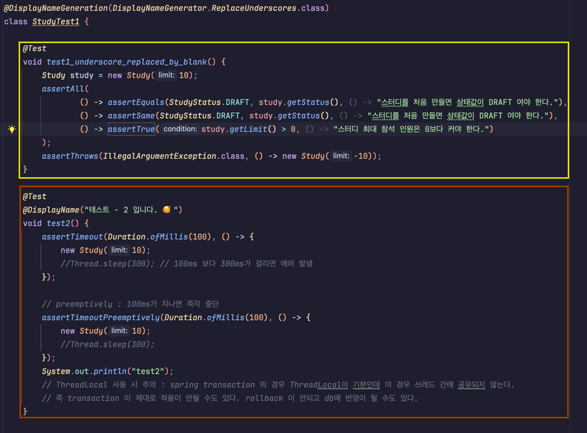

# Junit5의 테스트 인스턴스 
테스트를 실행하려면 테스트 클래스의 인스턴스를 만들어야 합니다.
**Junit5에서는 기본적으로 테스트 메소드마다 테스트 인스턴스를 새로 만듭니다.**
아래의 그림 속 두가지 클래스는 가각 다른 인스턴스를 생성하게 됩니다.


### 왜 테스트마다 인스턴스를 새로 만들었을까?
테스트 간의 의존성을 줄이기 위해

# Junit5의 테스트 간의 의존성
테스트 코드를 선언한 순서대로 실행하는 것처럼 보이지만 실제로는 그렇지 않습니다.
테스트 간의 의존성을 줄이기 위해 테스트 메소드의 실행 순서를 보장하지 않음.

### Junit5의 테스트 인스턴스 클래스당 하나 생성하기 && Junit5의 테스트 순서 지정해주기
```java
@TestMethodOrder(MethodOrderer.OrderAnnotation.class)
@TestInstance(TestInstance.Lifecycle.PER_CLASS)
public class StudyTest7 {

    int value = 0;

    @Test
    @Order(1)
    void create() {
        System.out.println("create ");
        System.out.println(value++);
    }

    @Test
    @Order(2)
    void create1() {
        System.out.println("create 1");
        System.out.println(value++);
    }

    @Test
    @Order(3)
    void create2() {
        System.out.println("create 2 ");
        System.out.println(value++);
    }
}
```