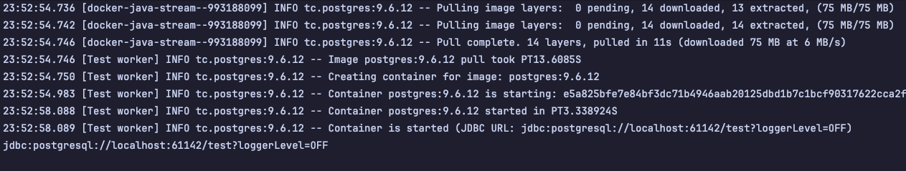

 ---
title:  "[The java] 애플리케이션을 테스트하는 다양한 방법 - 5"

categories:
  - java-application-test
tags:
  - [java-application-test]

toc: true
toc_sticky: true

breadcrumbs: true

date: 2024-07-24
last_modified_at: 2024-07-24
---

# Docker와 Test

### Testcontainers

- 테스트에서 사용하는 컨테이너를 쉽게 사용할 수 있도록 지원하는 라이브러리
```java
@Testcontainers
class StudyServiceTest {

  @Mock
  MemberService memberService;

  @Container
  static PostgreSQLContainer postgreSqlContainer = new PostgreSQLContainer()
    .withDatabaseName("studytest");

  @BeforeAll
  static void beforeAll() {
    postgreSqlContainer.start();
    System.out.println(postgreSqlContainer.getJdbcUrl());
  }

  @AfterAll
  static void afterAll() {
    postgreSqlContainer.stop();
  }
}
```




### 만약 테스트에 사용할 컨테이너가 없다면?
```java
@Testcontainers
class StudyServiceTest {
  
  @Container
  static GenericContainer genericContainer = new GenericContainer("my-generic-image")
    .withEnv("A", "B"); // 환경변수 설정

}
```

### 도커 컴포즈를 직접 사용하고 싶다면?

```java
@Testcontainers
class StudyServiceTest {

  @Container
  static DockerComposeContainer composeContainer = new DockerComposeContainer(new File("docker-compose.yml"))
    .withExposedService("service", 8080);
  
}
```

### 만약 너무 많은 컨테이너 때문에 띄우는데 시간이 오래 걸린다면?
- `wait` 을 사용하여 기다리는 시간을 조절할 수 있다.
```java
@Testcontainers
class StudyServiceTest {

  @Container
  public static DockerComposeContainer container = new DockerComposeContainer(new File("docker-compose.yml"))
    .withExposedService("service", 8080, Wait.forListeningPort().withStartupTimeout(Duration.ofSeconds(30)));

}
```


