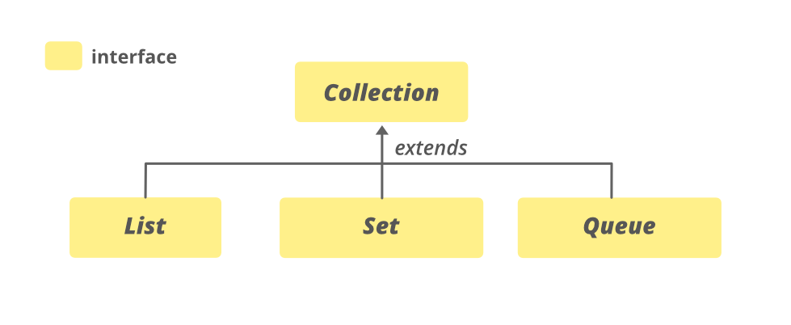

# Collection Interface
컬렉션 계층 구조 의 루트 인터페이스입니다.
아래처럼 아주 많은 구현체가 있지만 다 써본적은 없습니다.
List, Set, Map정도만 사용한 것 같습니다.

All Known Subinterfaces:
BeanContext, BeanContextServices, BlockingDeque<E>, BlockingQueue<E>, Deque<E>, List<E>, NavigableSet<E>, Queue<E>, Set<E>, SortedSet<E>, TransferQueue<E>

# List
순서가 있는 데이터의 집합입니다. 
데이터의 중복이 가능합니다.
- ArrayList
- LinkedList
- Vector

### ArrayList
한글로 하면 `배열리스트` 정도입니다.
배열의 장단점을 그대로 담은 것 같습니다.
기본적으로 `index`를 이용하며 인자들이 순차적으로 담깁니다.

### LinkedList
한글로 하면 `연결리스트` 인데 자료구조 중에서 Double Linked List를 구현한 것 같습니다.
항상 실제 구현 클래스를 한번씩 열어보는데 실제 클래스를 열어보면 `transient`라는 키워드가 있습니다.
first, last 변수의 직렬화를 방지한 클래스입니다. 
그래서 한동안 고민해본 결과 연결리스트는 인자들의 주소가 각기 다르기 때문에 arrayList보다 구현이 조금 더 복잡합니다.
이 복잡함을 직렬화까지 할 수 없어서 아무래도 변수의 직렬화를 막아둔 것 같다 라는 생각을 했습니다.

### ArrayList vs LinkedList
Array가 index 기반이라 접근이 빠릅니다.
Array가 순차적인 연산이 빠르다고 생각하면 됩니다.
하지만 중간에 삽입하거나 삭제하는 연산은 Linked가 많이 빠릅니다.
Array는 중간에 삽입하면 뒷 인덱스들을 다 밀어야 하지만 Linked는 선행 인자의 주소와 후행 인자의 주소만 현재 생성한 인자의 주소로 연결하면 됩니다.
메모리는 Array가 조금 덜 사용합니다. LinkedList는 참조 메모리가 필요해서입니다.

### Stack과 Queue
Java에서 Stack은 Vector를 상속받아 구현되어 있습니다.
Queue는 LinkedList입니다.
```java
Queue<String> queue = new LinkedList<>();
queue.offer("a");

// 실제 구현
public boolean offer(E e) {
  return add(e);
}
```

### Iterator
Collection을 읽어오는 방법을 표준화한 것

# Set
순서를 유지하지 않는 데이터의 집합입니다.
데이터의 중복이 불가능합니다.
- HashSet
- TreeSet

# Map
Key, Value 쌍으로 이루어진 데이터의 집합입니다.
순서를 유지하지 않습니다.
키는 중복이 불가능하지만 값은 가능합니다. 
- HashMap
- LinkedHashMap
- TreeMap
- HashTable
- Properties
