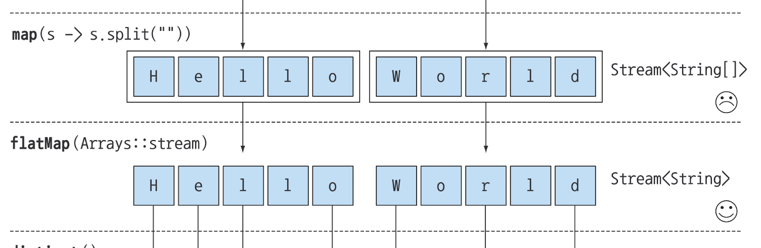

# 필터링
### 프레디케이트 필터링
- 프레디케이트 : 참 또는 거짓을 반환하는 함수
- 프레디케이트를 인수로 받아 스트림의 요소를 하나씩 평가한다.

```java
List<Dish> vegetarianMenu = menu.stream()
  .filter(Dish::isVegetarian)
  .collect(toList());
```

### distinct 필터링
```java
public class Example2 {
  public static void main(String[] args) {
    List<Integer> list = List.of(1, 2, 3, 4, 5, 2, 3, 4, 5, 6);
    list.stream()
      .filter(i -> i % 2 == 0)
      .distinct()
      .forEach(System.out::print);
  }
}
//246
```

# 스트림 슬라이싱
- 스트림의 일부 요소를 잘라내거나 건너뛰기


### 프레디케이트를 이용한 슬라이싱 (takeWhile, dropWhile)
- takeWhile : 프레디케이트가 참인 동안 요소를 선택
  - filter는 조건에 대해 다 검사하며 참인것만 다음으로 넘어가지만 takeWhile은 조건에 대해 참이 아닐경우 바로 거기서 멈추게 된다.
- dropWhile : 프레디케이트가 참인 동안 요소를 패스

```java
private static void takeWhileAndDropWhile() {
    List<Dish> take = dishes.stream()
            .takeWhile(d -> d.getCalories() > 320)
            .collect(Collectors.toList());

    List<Dish> drop = dishes.stream()
            .dropWhile(d -> d.getCalories() > 320)
            .collect(Collectors.toList());

    System.out.println("take");
    take.forEach(dish -> System.out.print(dish.getName()));
    System.out.println();
    System.out.println("drop");
    drop.forEach(dish -> System.out.print(dish.getName()));
}
```

### 스트림 축소 (limit)
- limit : 스트림을 축소하는 연산
```java
private static void limit() {
    List<Dish> limit = dishes.stream()
            .limit(3)
            .collect(Collectors.toList());

    limit.forEach(dish -> System.out.print(dish.getName()));
}
```

### 요소 건너뛰기 (skip)
- skip : 처음 n개의 요소를 제외하는 연산
```java
private static void skip() {
    List<Dish> skip = dishes.stream()
            .skip(3)
            .collect(Collectors.toList());

    skip.forEach(dish -> System.out.print(dish.getName()));
}
```


# 매핑
- 스트림은 함수를 인수로 받는 `map()` 메서드를 지원한다.
### flatMap
- 
```java
private static void mapAnsFlatMap() {
    List<String> strings = List.of("Hello", "World");
    strings.stream()
            .map(s -> s.split(""))
            .distinct()
            .forEach(System.out::println);

    strings.stream()
            .map(s -> s.split(""))
            .flatMap(Arrays::stream)
            .distinct()
            .forEach(System.out::print);
}
```


```text
[Ljava.lang.String;@7a81197d
[Ljava.lang.String;@5ca881b5
HeloWrd
```

### 예제
`example3_1`은 제 마음대로 풀었습니다.
```java
public class Example2 {
  static List<Integer> numbers1 = List.of(1, 2, 3);
  static List<Integer> numbers2 = List.of(3, 4);

  public static void main(String[] args) {
    example3_1();
    example3_2();
  }

  private static void example3_2() {
    List<int[]> collected = numbers1.stream()
      .flatMap(num1 -> numbers2.stream()
        .filter(num2 -> (num1 + num2) % 3 == 0)
        .map(num2 -> new int[]{num1, num2})
      ).toList();

    collected.stream().forEach(ints -> {
      System.out.print("( ");
      for (int i : ints) {
        System.out.print(i);
      }
      System.out.println(" )");
    });
  }

  private static void example3_1() {
    List<List<Integer>> collect = numbers2.stream()
      .map(num2 -> numbers1.stream()
        .filter(num1 -> (num1 + num2) % 3 == 0)
        .map(num1 -> List.of(num1, num2))
        .toList()
      ).flatMap(Collection::stream)
      .toList();

    collect.forEach(System.out::println);
  }
}
```

# 검색
`allMatch`, `anyMatch`, `noneMatch`, `findFirst`, `findAny`
### `allMatch`, `anyMatch`, `noneMatch`는 쇼트서킷
- 때로는 전체 스트림을 처리하지 않더라도 결과를 알 수 있다.
- 쇼트서킷 : 결과를 알 수 있으면 바로 반환한다.

### `findFirst`, `findAny`
- `findFirst`, `findAny` 이미 순서가 정해진 스트림 내에서 값을 찾아내면 결과를 반환하므로 둘은 같은 결과를 반환하게 되지만 왜 두개나 있는 것일까?
- 병렬성을 활용할 때 `findAny`를 사용하면 더 좋은 성능을 낼 수 있다.
```java
Integer findFirst = numbers1.stream()
        .filter(i -> i % 3 == 0)
        .findFirst()
        .get();

Integer findAny = numbers1.stream()
        .filter(i -> i % 3 == 0)
        .findAny()
        .get();

System.out.println(findFirst);
System.out.println(findAny);
```

# 리듀싱
- 모든 요소를 처리해서 값으로 도출하는 것

### sum
- `reduce` 메서드는 두 인수를 받는다.
  - 초기값 ( 있어도 되고 없어도 되지만, 없을 경우엔 `Optional`로 반환된다.)
  - 두 요소를 조합해서 새로운 값을 만드는 람다
```java
private static void reduce_sum() {
    Integer sum = numbers1.stream().reduce(0, (a, b) -> a + b);
    System.out.println(sum);
    numbers1.stream().reduce(Integer::sum).ifPresent(System.out::println);
}
```

### max
```java
private static void reduce_max() {
    numbers1.stream().reduce(Integer::max).ifPresent(System.out::println);
}
```


