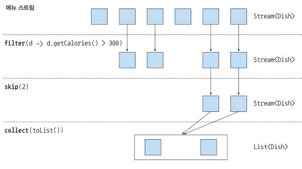

# 필터링
### 프레디케이트 필터링
- 프레디케이트 : 참 또는 거짓을 반환하는 함수
- 프레디케이트를 인수로 받아 스트림의 요소를 하나씩 평가한다.

```java
List<Dish> vegetarianMenu = menu.stream()
  .filter(Dish::isVegetarian)
  .collect(toList());
```

### distinct 필터링
```java
public class Example2 {
  public static void main(String[] args) {
    List<Integer> list = List.of(1, 2, 3, 4, 5, 2, 3, 4, 5, 6);
    list.stream()
      .filter(i -> i % 2 == 0)
      .distinct()
      .forEach(System.out::print);
  }
}
//246
```

# 스트림 슬라이싱
- 스트림의 일부 요소를 잘라내거나 건너뛰기


### 프레디케이트를 이용한 슬라이싱 (takeWhile, dropWhile)
- takeWhile : 프레디케이트가 참인 동안 요소를 선택
  - filter는 조건에 대해 다 검사하며 참인것만 다음으로 넘어가지만 takeWhile은 조건에 대해 참이 아닐경우 바로 거기서 멈추게 된다.
- dropWhile : 프레디케이트가 참인 동안 요소를 패스

```java
private static void takeWhileAndDropWhile() {
    List<Dish> take = dishes.stream()
            .takeWhile(d -> d.getCalories() > 320)
            .collect(Collectors.toList());

    List<Dish> drop = dishes.stream()
            .dropWhile(d -> d.getCalories() > 320)
            .collect(Collectors.toList());

    System.out.println("take");
    take.forEach(dish -> System.out.print(dish.getName()));
    System.out.println();
    System.out.println("drop");
    drop.forEach(dish -> System.out.print(dish.getName()));
}
```

### 스트림 축소 (limit)
- limit : 스트림을 축소하는 연산
```java
private static void limit() {
    List<Dish> limit = dishes.stream()
            .limit(3)
            .collect(Collectors.toList());

    limit.forEach(dish -> System.out.print(dish.getName()));
}
```

### 요소 건너뛰기 (skip)
- skip : 처음 n개의 요소를 제외하는 연산
```java
private static void skip() {
    List<Dish> skip = dishes.stream()
            .skip(3)
            .collect(Collectors.toList());

    skip.forEach(dish -> System.out.print(dish.getName()));
}
```


# 매칭
# 곰샥
# 매칭
# 리듀싱