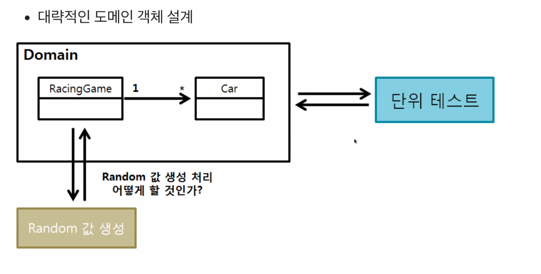
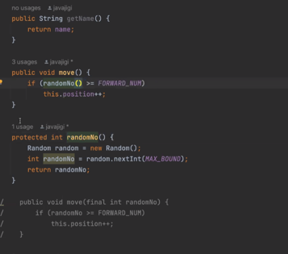

### 1차적으로 도메인 로직을 테스트하는 것에 집중 
도메인 모델이 핵심 비즈니스이기 때문에 이것에 테스트를 집중해라.

### 도메인을 설계 할 수 있는 역량이 필요
Object를 설계하는 것

### OOP만 잘해도 된다.

### 리팩터링이 몇 배는 더 어렵다.
아무것도 없는 상태에서 새롭게 구현하는 것보다
레거시 코드가 있는 상태에서 리팩터링하는 것이 몇 배는 더 어렵다.

### IO는 테스트하기 어렵다.
외부 시스템과 의존하거나 하는 경우는 테스트하기 어렵다.
Random, Date, 우승자 이름 출력하기 등등.. 이것들은 테스트하기 어렵다.

### 요구사항 변경이 잦거나 리팩터링의 빈도가 높은 코드는 tdd를 필수로 해야한다.
요구사항 변경이 잦은 부분에 대해선 설계를 잘해야 한다.
꾸준히 설계가 개선되어야 한다.

### Test fixture

### 생성자는 많아도 된다.

###  테스트를 위한 메서드 추가는 하면 안된다. 대신 생성자를 만들어라.
테스트 메서드는 캡슐화를 위반합니다.
하지만 생성자 추가는 캡슐화가 깨지지 않습니다.

### 접근제어자도 의식하면서 개발하자.
우리는 너무 public을 남발한다.

### getter 절대 쓰지 않기
객체의 데이터를 꺼내오지 말고 데이터를 달라고 요구하자.
😀 객체에게 메세지를 보낸다! 객체는 능동적이어야 한다!

### 객체지향 프로그래밍의 이점, 객체와 대화를 하면 무엇이 이점인가?
단위 테스트가 쉬워진다.

### 패키지레벨 접근 제어자도 써보자

### 테스트가 어려운 부분을 분리하고 테스트가 쉬운 부분을 테스트하자!

### 오브젝트 그래프
A -> B -> C 
A가 B를 사용하고 B가 C를 사용하는 상황에서 마지막 노드인 `C`를 테스트 해야 한다.
Racing의 race() -> Car의 move() -> Random의 random()
이렇게 Random은 테스트하기 어렵습니다.
그러면 결국 car도, racing도 전부 테스트하기 어려워집니다.

Racing의 race() -> Car의 move() -> Random의 random()
이 의존관계를 반대로 해야합니다. 아래처럼!
Random의 random() -> Racing의 race() -> Car의 move()

### 가짜 객체를 이용한 단위테스트를 멈춰야 한다.
oop적인 프로그래밍이 아니기 때문에 난발하면 안된다.
모킹없이 단위테스트 할 수 있는 역량을 키워야 합니다.

### 메소드를 protected로 만든 후 상속받아서 점진적 리팩토링을 할 수 있다.

