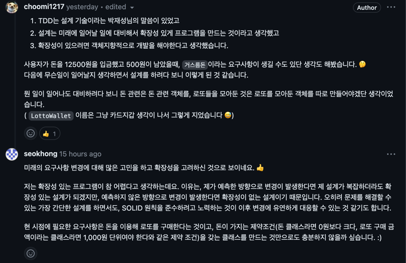

# 로또 피드백 
[피드백 1](https://github.com/next-step/java-lotto/pull/3371)
[피드백 2](https://github.com/next-step/java-lotto/pull/3447)

1. 사용하지 않는 상수 삭제
2. 코드 컨벤션 ( 클래스명과 중괄호 사이의 띄어쓰기 )
3. 클래스 이름 지적
4. 변수 선언을 통한 가독성 향상 지적
5. 코드 컨벤션 (필드와 생성자 사이의 빈 줄 추가)
6. No newline at end of file
7. 클래스 내부에서만 사용할 상수라면 private 접근 제어자를 사용
8. 
설계에 대한 피드백
   - 