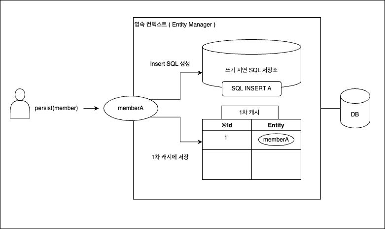
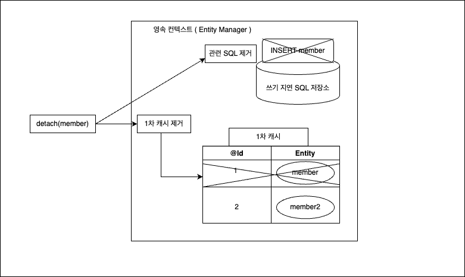
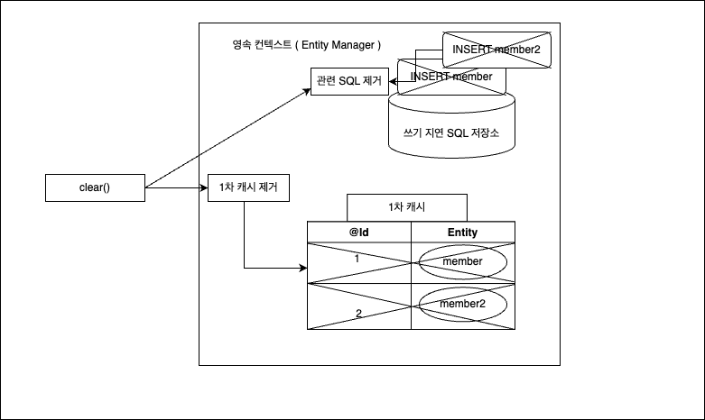
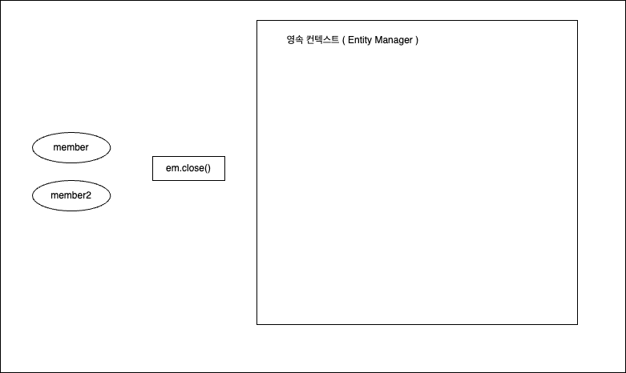

# 3장 영속성 관리

### 엔티티 매니저 팩토리와 엔티티 매니저


두개의 엔티티매니저를 생성했음에도 하나는 DB 커넥션을 사용하고 하나는 DB 커넥션을 사용하지 않습니다.

**엔티티 매니저는 DB 연결이 필요한 시점까지 커넥션을 얻지 않습니다.**

JPA 구현체들은 EntityManagerFactory를 생성할 때 DB 커넥션 풀을 생성합니다.

### 영속성 컨텍스트란?

**엔티티를 영구 저장하는 환경**

엔티티 매니저로 엔티티에 CRUD 작업을 하면 엔티티 매니저는 영속성 컨텍스트에 엔티티를 보관하고 관리합니다.

### 엔티티의 생명주기

- 비영속 : 영속성 컨텍스트와 관련이 없는 상태
- 영속 : 영속성 컨텍스트에 저장된 상태
- 준영속 : 영속성 컨텍스트에 저장 되었다가 분리된 상태
- 삭제 : 엔티티가 삭제된 상태


### 영속성 컨텍스트의 특징

- 영속성 컨텍스트는 엔티티를 식별자 값 `@Id` 로 구분합니다.
- JPA는 커밋시 영속성 컨텍스트에 있는 엔티티를 DB에 반영합니다.

### 영속성 컨텍스트가 엔티티를 관리할 때의 장점

- 1차 캐시
- 동일성 보장
- 트랜잭션을 지원하는 쓰기 지연
- 변경 감지
- 지연로딩

### 영속성 컨텍스트와 엔티티의 흐름

영속성 컨텍스트는 내부에 **1차캐시** 라는 걸 가지고 있습니다.

```java
// 엔티티를 생성한 상태 ( 비영속 )
Member member = new Member();
member.setName("cho");
member.setAge(10);

// 엔티티를 영속 ( 영속 )
em.persist(member);
```

### 1. 캐싱

위 코드를 실행하면 아래처럼 1차 캐시에 Member 엔티티가 저장됩니다. ( 아직 DB에 저장된 상태는 아닙니다. )

1차 캐시의 키는 식별자 값으로 DB의 PK입니다.

JPA는 1차 캐시를 이용한 **반복 가능한 읽기** 의 트랜잭션을 애플리케이션 차원에서 제공합니다.


### 2. 1차 캐시에서 조회

```java
Member findMember = em.find(Member.class, id);
```

em.find()를 호출하면 먼저 1차 캐시에서 엔티티를 찾고 1차 캐시에 없으면 DB에서 조회합니다.


### 3. DB 조회

만약 `em.find()` 했을 때 1차 캐시에 엔티티가 없으면 **DB를 조회해서 엔티티를 생성 후 캐시에 저장하고 영속 상태의 엔티티를 리턴합니다.**


### 영속 엔티티의 동일성 보장

`em.find(Member.class, member.getId());` 이 메소드를 백번 실행해도 백번 다 같은 엔티티 인스턴스를 반환합니다.

**영속성 컨텍스트는 성능상 이점과 엔티티의 동일성을 보장합니다.**

```java
Member member = new Member();
member.setName("cho");
member.setAge(20);

em.persist(member);

Member member1 = em.find(Member.class, member.getId());
Member member2 = em.find(Member.class, member.getId());

em.remove(member);

System.out.println(member1 == member2);
```

```java
Hibernate: 
    select
        nextval ('hibernate_sequence')
true
Hibernate: 
    insert 
    into
        member
        (age, name, id) 
    values
        (?, ?, ?)
Hibernate: 
    delete 
    from
        member 
    where
        id=?
```

### 4. 엔티티 등록

**엔티티 매니저는 트랜잭션을 커밋하기 전까지 DB에 엔티티를 저장하지 않고 내부 쿼리 저장소에 SQL을 저장합니다.**

그리고는 `transaction.commin()` 을 할 때 모아둔 쿼리를 DB에 보냅니다.

이를 **쓰기지연** 이라고 합니다.

```java
EntityManagerFactory emf = Persistence.createEntityManagerFactory("myApp");
EntityManager em = emf.createEntityManager();
EntityTransaction tx = em.getTransaction();

// 트랜잭션 시작
tx.begin();

Member memberA = new Member();
memberA.setName("A");
memberA.setAge(20);

Member memberB = new Member();
memberB.setName("B");
memberB.setAge(30);

em.persist(memberA);
em.persist(memberB);

//커밋하는 순간 DB에 Insert를 합니다.
tx.commit();

emf.close();
```




1. `memberA` 를 영속 컨텍스트에 **영속화** 합니다.
2. 영속성 컨텍스트가 영속화된 `memberA` 를 1차 캐시에 저장함과 동시에 `memberA` 의 insert SQL을 생성해 저장소에 저장합니다.
3. `memberB` 를 영속 컨텍스트에 ****영속화 하고 마찬가지로 SQL을 저장소에 저장합니다.
4. 사용자가 트랜잭션을 커밋합니다.
5. 엔티티 매니저는 영속성 컨텍스트를 `flush` 합니다.
    1. flush : 쓰기 지연 SQL 저장소에 모인 쿼리를 DB에 전송하는 것.
6. DB에 영속성 컨텍스트 내용을 반영 후 DB 트랜잭션을 커밋합니다.

### 쓰기 지연에 트랜잭션이 가능한 이유

아래처럼 2개의 insert 쿼리를 전송 했을때 

1. 매번 DB에 쿼리를 날리고 마지막에 트랜잭션을 커밋한다.
2. 쿼리를 모아뒀다 한방에 날리고 트랜잭션을 커밋한다.

결국 트랜잭션 커밋이 마지막에 이뤄지는 **결과는 동일**합니다.

```java
tx.begin();

em.persist(memberA);`
em.persist(memberB);

tx.end();
```

### 5. 엔티티 수정

엔티티를 조회 한 후 데이터를 변경하기만 하면 됩니다.

### Dirty Checking ( 변경 감지 )

엔티티의 변경 사항을 DB에 자동으로 반영하는 변경감지라는 기능이 있습니다.

JPA는 엔티티를 영속성 컨텍스트에 보관할 때 최초 상태를 복사해서 저장 해두는데 이것을 스냅샷이라고 합니다.

그리고 **플러시 시점에 스냅샷과 엔티티를 비교해서 변경된 엔티티를 찾습니다.**

**변경 감지는 영속성 컨텍스트가 관리하는 엔티티에만 적용됩니다.**

```java
EntityManagerFactory emf = Persistence.createEntityManagerFactory("myApp");
EntityManager em = emf.createEntityManager();
EntityTransaction tx = em.getTransaction();

tx.begin();

Member member = new Member();
member.setName("cho");
member.setAge(20);

em.persist(member);;

member.setName("Jo");
member.setAge(30);

tx.commit();

emf.close();
```

```java
Hibernate: 
    select
        nextval ('hibernate_sequence')
Hibernate: 
    insert 
    into
        member
        (age, name, id) 
    values
        (?, ?, ?)
Hibernate: 
    update
        member 
    set
        age=?,
        name=? 
    where
        id=?
```


1. 사용자가 트랜잭션 커밋하면 엔티티 매니저가 flush() 를 호출합니다.
2. 엔티티와 스냅샷을 비교합니다.
3. 변경된 엔티티에 대한 `Update` 쿼리를 쓰기 지연 SQL 저장소에 저장합니다.
4. 모든 엔티티에 대한 비교가 끝나면, 쓰기 지연 SQL 저장소에 저장된 모든 SQL(Insert, Update, Delete)이 데이터베이스에 전송됩니다.
5. DB 트랜잭션 커밋합니다.

Update는 기본적으로 모든 필드에 대한 Update를 진행합니다.

- 수정 쿼리를 미리 생성해두고 재사용 할 수 있다.
- 쿼리 캐싱을 이용한 쿼리 재사용
- 필드가 너무 많아 수정된 데이터만 사용한 동적 SQL을 만들고 싶다면 *`org.hibernate.annotations.DynamicUpdate`* 를 이용하면 됩니다.

### 6. 엔티티 삭제

엔티티 등록과 비슷한 과정을 거칩니다.

`em.remove(member)` 를 호출한 순간 `member` 는 영속성 컨텍스트에서 삭제 됩니다.

### 플러시 (flush)

**영속성 컨텍스트의 변경 내용을 DB에 반영합니다.**

- `em.flush()` 직접 호출
- 트랜잭션 커밋시 자동 호출
- JPQL 실행 시 자동 호출

### JPQL 실행 시 자동 플러시

아래 코드는 memberA, memberB, memberC를 영속상태로 만들고 JPQL을 실행했습니다.

이때 A, B, C는 영속성 컨텍스트에만 있고 DB에는 없어서 JPQL은 아무것도 조회 하지 못합니다. 그래서 JPQL을 실행하기 전에 flush 해서 변경 내용을 DB에 반영해야 합니다.

```java
EntityManagerFactory emf = Persistence.createEntityManagerFactory("myApp");
EntityManager em = emf.createEntityManager();
EntityTransaction tx = em.getTransaction();

tx.begin();

Member memberA = new Member();
memberA.setName("A");
memberA.setAge(10);

Member memberB = new Member();
memberB.setName("B");
memberB.setAge(20);

Member memberC = new Member();
memberC.setName("C");
memberC.setAge(30);

em.persist(memberA);
em.persist(memberB);
em.persist(memberC);

TypedQuery<Member> query = em.createQuery("select m from Member m", Member.class);
List<Member> members = query.getResultList();

members.forEach(m -> {
    System.out.println("name : " + m.getName());
});
```

```java
Hibernate: 
    select
        nextval ('hibernate_sequence')
Hibernate: 
    select
        nextval ('hibernate_sequence')
Hibernate: 
    select
        nextval ('hibernate_sequence')
Hibernate: 
    insert 
    into
        member
        (age, name, id) 
    values
        (?, ?, ?)
Hibernate: 
    insert 
    into
        member
        (age, name, id) 
    values
        (?, ?, ?)
Hibernate: 
    insert 
    into
        member
        (age, name, id) 
    values
        (?, ?, ?)
Hibernate: 
    select
        member0_.id as id1_0_,
        member0_.age as age2_0_,
        member0_.name as name3_0_ 
    from
        member member0_
name : A
name : B
name : C
```

### 준영속

영속성 컨텍스트에서 분리된 것을 준영속 상태라고 합니다.

준영속 상태의 엔티티는 영속성 컨텍스트가 제공하는 기능을 사용할 수 없습니다.

준영속 상태의 엔티티는 **식별자 값은 가지고 있습니다.**

- `em.detach(entity)`
- `em.clear()`
- `em.close()`

```java
Member member = new Member();
member.setName("cho");
member.setAge(20);

em.persist(member); //영속

em.detach(member); //준영속

tx.commit(); 
```

```java
Hibernate: 
    select
        nextval ('hibernate_sequence')
```







### 병합

준영속 상태의 엔티티의 정보로 새로운 영속 상태의 엔티티를 반환합니다.

```java
public class _6_Merge {

    static EntityManagerFactory emf = Persistence.createEntityManagerFactory("myApp");
    public static void main(String[] args) {
        Member member = createMember(new Member("cho", 20)); //준영속
        member.setName("조영미");
        member.setAge(26);
        mergeMember(member);

    }

    private static void mergeMember(Member member) {
        EntityManager em = emf.createEntityManager();
        EntityTransaction tx = em.getTransaction();

        tx.begin();
        Member findBeforeMerged = em.find(Member.class, member.getId());
        System.out.println("FIND BEFORE MERGED MEMBER NAME '" + findBeforeMerged.getName() + "'");
        Member merged = em.merge(member);
        tx.commit();

        System.out.println(" DETACH MEMBER NAME '" + member.getName() + "'");
        System.out.println(" MERGED MEMBER NAME '" + merged.getName() + "'");

        System.out.println("Entity Manager has MEMBER ? " + em.contains(member));
        System.out.println("Entity Manager has MERGED ? " + em.contains(merged));

        Member findAfterMerged = em.find(Member.class, merged.getId());

        System.out.println("FIND AFTER MERGED MEMBER NAME '" + findAfterMerged.getName() + "'");

        em.close();
    }

    static Member createMember(Member member) {
        EntityManager em = emf.createEntityManager();
        EntityTransaction tx = em.getTransaction();

        tx.begin();
        em.persist(member);
        tx.commit();
        em.close();

        return member;
    }
}
```

```java
Hibernate: 
    select
        nextval ('hibernate_sequence')
Hibernate: 
    insert 
    into
        member
        (age, name, id) 
    values
        (?, ?, ?)
Hibernate: 
    select
        member0_.id as id1_0_0_,
        member0_.age as age2_0_0_,
        member0_.name as name3_0_0_ 
    from
        member member0_ 
    where
        member0_.id=?
FIND BEFORE MERGED MEMBER NAME 'cho'
Hibernate: 
    update
        member 
    set
        age=?,
        name=? 
    where
        id=?
 DETACH MEMBER NAME '조영미'
 MERGED MEMBER NAME '조영미'
Entity Manager has MEMBER ? false
Entity Manager has MERGED ? true
FIND AFTER MERGED MEMBER NAME '조영미'
```


1. `merge(member)` 를 실행합니다.
2. 준영속 엔티티의 `@Id` 로 1차 캐시에서 엔티티를 찾습니다.
3. 있으면 캐시에서 돌려주고 없으면 DB를 조회 합니다.
4. 엔티티를 캐시에 저장합니다.
5. 준영속 엔티티의 값으로 조회한 엔티티 ( 영속 상태 )를 채웁니다.

소스 실행 결과를 보면 `FIND BEFORE MERGED MEMBER` 와 `FIND AFTER MERGED MEMBER` 의 값이 다르고 `merge` 를 실행하면 `Update` SQL이 날아갑니다.

즉, 머지를 함과 동시에 준영속 엔티티의 값으로 영속 엔티티의 값이 변경이 됩니다.

### 비영속 병합

`merge` 는 캐시 조회 후 없으면 DB 조회를 하는데 만약 **DB에도 없으면 새로운 엔티티를 생성**합니다.