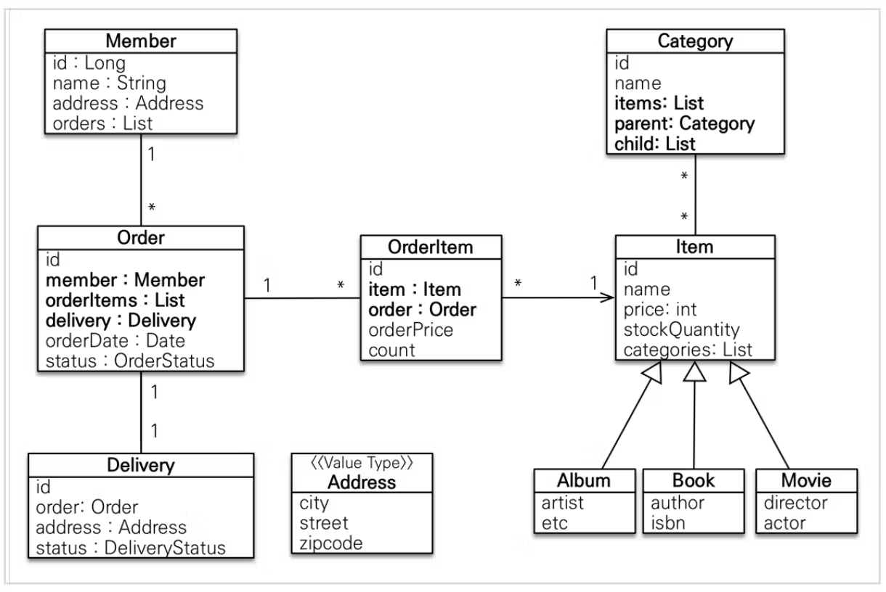
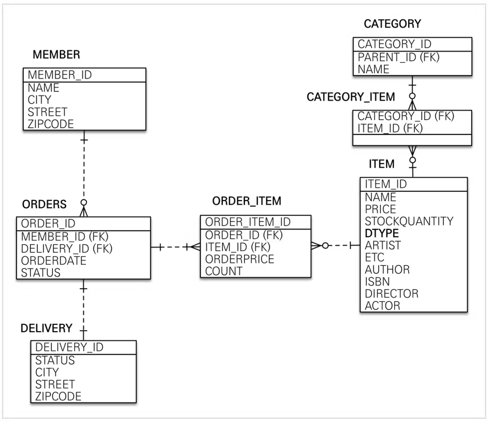

### 회원기능
- 회원 등록
- 회원 조회
### 상품기능
- 상품 등록
- 상품 수정
- 상품 조회
### 주문기능
- 상품 주문
- 주문 내역 조회
- 주문 취소 
### 기타 요구사항
- 상품의 종류는 도서, 음반, 영화
- 상품을 카테고리로 구분할 수 있다.
- 상품 주문 시 배송정보를 입력할 수 있다.

### 도메인 모델 설계

### 테이블 모델링

### 연관관계 설계
1. Member 와 Order
  - 1:N 양방향
  - Order 주인
2. OrderItem 과 Order
  - N:1 양방향
  - OrderItem 주인
3. OrderItem 과 Item
   - N:1 단방향
   - Item은 OrderItem을 알 필요가없다.
   - OrderItem 주인
4. Order 와 Delivery
   - 1:1 양방향
5. Category 와 Item
   - N:M 양방향
   - 🤔공부를 위해 사용하는 것뿐
   - 만약 제가 해야한다면 카테고리 쪽엔 매핑 데이터를 넣지 않았을겁니다.

### 혼자 실습!! 😤