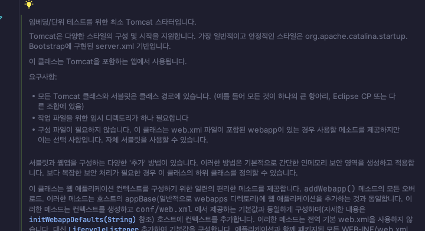

# 시작부터 끝까지

1. SpringApplication -> run()
2. DefaultListableBeanFactory -> registerBeanDefinition()
3. GenericApplicationContext가 BeanDefinitionHolder 객체를 빈 팩토리에 저장
4. Tomcat으로 넘어와서 TomcatWebServer가 톰캣 서버를 start()함
5. SpringTemplateEngine을 초기화
6. SpringApplication으로 돌아옴

### 톰캣 카탈리나(Catalina)
톰캣은 여러개의 기능(부품)으로 구성한다. 톰캣의 코어 컴포넌트는 카탈리나라고 칭합니다.
카탈리나는 톰캣의 서블릿 스펙의 실질적인 구동을 제공합니다. 
톰캣 서버를 가동시킬 경우, 카탈리나를 구동시킨 것이라고 생각하면 됩니다.

### 등록된 빈 목록
applicationAvailability
applicationTaskExecutor
basicErrorController
beanListPrinter
beanNameHandlerMapping
beanNameViewResolver
characterEncodingFilter
classPathFileSystemWatcher
classPathRestartStrategy
conditionEvaluationDeltaLoggingListener
conventionErrorViewResolver
defaultServletHandlerMapping
defaultTemplateResolver
defaultViewResolver
dispatcherServlet
dispatcherServletRegistration
error
errorAttributes
errorPageCustomizer
errorPageRegistrarBeanPostProcessor
fileSystemWatcherFactory
fileWatcher
flashMapManager
forceAutoProxyCreatorToUseClassProxying
formContentFilter
handlerExceptionResolver
handlerFunctionAdapter
helloController
homeController
httpMessageConvertersRestClientCustomizer
httpRequestHandlerAdapter
jacksonObjectMapper
jacksonObjectMapperBuilder
jpaMemberRepository
jsonComponentModule
jsonMixinModule
jsonMixinModuleEntries
lifecycleProcessor
liveReloadServer
liveReloadServerEventListener
localeCharsetMappingsCustomizer
localeResolver
mappingJackson2HttpMessageConverter
mbeanExporter
mbeanServer
memberController
memberRepository
memberService
memoryMemberRepository
messageConverters
multipartConfigElement
multipartResolver
mvcContentNegotiationManager
mvcConversionService
mvcHandlerMappingIntrospector
mvcPathMatcher
mvcPatternParser
mvcResourceUrlProvider
mvcUriComponentsContributor
mvcUrlPathHelper
mvcValidator
mvcViewResolver
objectNamingStrategy
optionalLiveReloadServer
org.springframework.aop.config.internalAutoProxyCreator
org.springframework.boot.autoconfigure.AutoConfigurationPackages
org.springframework.boot.autoconfigure.admin.SpringApplicationAdminJmxAutoConfiguration
org.springframework.boot.autoconfigure.aop.AopAutoConfiguration
org.springframework.boot.autoconfigure.aop.AopAutoConfiguration$ClassProxyingConfiguration
org.springframework.boot.autoconfigure.availability.ApplicationAvailabilityAutoConfiguration
org.springframework.boot.autoconfigure.context.ConfigurationPropertiesAutoConfiguration
org.springframework.boot.autoconfigure.context.LifecycleAutoConfiguration
org.springframework.boot.autoconfigure.context.PropertyPlaceholderAutoConfiguration
org.springframework.boot.autoconfigure.http.HttpMessageConvertersAutoConfiguration
org.springframework.boot.autoconfigure.http.HttpMessageConvertersAutoConfiguration$StringHttpMessageConverterConfiguration
org.springframework.boot.autoconfigure.http.JacksonHttpMessageConvertersConfiguration
org.springframework.boot.autoconfigure.http.JacksonHttpMessageConvertersConfiguration$MappingJackson2HttpMessageConverterConfiguration
org.springframework.boot.autoconfigure.info.ProjectInfoAutoConfiguration
org.springframework.boot.autoconfigure.internalCachingMetadataReaderFactory
org.springframework.boot.autoconfigure.jackson.JacksonAutoConfiguration
org.springframework.boot.autoconfigure.jackson.JacksonAutoConfiguration$Jackson2ObjectMapperBuilderCustomizerConfiguration
org.springframework.boot.autoconfigure.jackson.JacksonAutoConfiguration$JacksonMixinConfiguration
org.springframework.boot.autoconfigure.jackson.JacksonAutoConfiguration$JacksonObjectMapperBuilderConfiguration
org.springframework.boot.autoconfigure.jackson.JacksonAutoConfiguration$JacksonObjectMapperConfiguration
org.springframework.boot.autoconfigure.jackson.JacksonAutoConfiguration$ParameterNamesModuleConfiguration
org.springframework.boot.autoconfigure.jmx.JmxAutoConfiguration
org.springframework.boot.autoconfigure.sql.init.SqlInitializationAutoConfiguration
org.springframework.boot.autoconfigure.ssl.SslAutoConfiguration
org.springframework.boot.autoconfigure.task.TaskExecutionAutoConfiguration
org.springframework.boot.autoconfigure.task.TaskExecutorConfigurations$SimpleAsyncTaskExecutorBuilderConfiguration
org.springframework.boot.autoconfigure.task.TaskExecutorConfigurations$TaskExecutorBuilderConfiguration
org.springframework.boot.autoconfigure.task.TaskExecutorConfigurations$TaskExecutorConfiguration
org.springframework.boot.autoconfigure.task.TaskExecutorConfigurations$ThreadPoolTaskExecutorBuilderConfiguration
org.springframework.boot.autoconfigure.task.TaskSchedulingAutoConfiguration
org.springframework.boot.autoconfigure.task.TaskSchedulingConfigurations$SimpleAsyncTaskSchedulerBuilderConfiguration
org.springframework.boot.autoconfigure.task.TaskSchedulingConfigurations$TaskSchedulerBuilderConfiguration
org.springframework.boot.autoconfigure.task.TaskSchedulingConfigurations$ThreadPoolTaskSchedulerBuilderConfiguration
org.springframework.boot.autoconfigure.thymeleaf.TemplateEngineConfigurations$DefaultTemplateEngineConfiguration
org.springframework.boot.autoconfigure.thymeleaf.ThymeleafAutoConfiguration
org.springframework.boot.autoconfigure.thymeleaf.ThymeleafAutoConfiguration$DefaultTemplateResolverConfiguration
org.springframework.boot.autoconfigure.thymeleaf.ThymeleafAutoConfiguration$ThymeleafWebMvcConfiguration
org.springframework.boot.autoconfigure.thymeleaf.ThymeleafAutoConfiguration$ThymeleafWebMvcConfiguration$ThymeleafViewResolverConfiguration
org.springframework.boot.autoconfigure.web.client.RestClientAutoConfiguration
org.springframework.boot.autoconfigure.web.client.RestTemplateAutoConfiguration
org.springframework.boot.autoconfigure.web.embedded.EmbeddedWebServerFactoryCustomizerAutoConfiguration
org.springframework.boot.autoconfigure.web.embedded.EmbeddedWebServerFactoryCustomizerAutoConfiguration$TomcatWebServerFactoryCustomizerConfiguration
org.springframework.boot.autoconfigure.web.servlet.DispatcherServletAutoConfiguration
org.springframework.boot.autoconfigure.web.servlet.DispatcherServletAutoConfiguration$DispatcherServletConfiguration
org.springframework.boot.autoconfigure.web.servlet.DispatcherServletAutoConfiguration$DispatcherServletRegistrationConfiguration
org.springframework.boot.autoconfigure.web.servlet.HttpEncodingAutoConfiguration
org.springframework.boot.autoconfigure.web.servlet.MultipartAutoConfiguration
org.springframework.boot.autoconfigure.web.servlet.ServletWebServerFactoryAutoConfiguration
org.springframework.boot.autoconfigure.web.servlet.ServletWebServerFactoryConfiguration$EmbeddedTomcat
org.springframework.boot.autoconfigure.web.servlet.WebMvcAutoConfiguration
org.springframework.boot.autoconfigure.web.servlet.WebMvcAutoConfiguration$EnableWebMvcConfiguration
org.springframework.boot.autoconfigure.web.servlet.WebMvcAutoConfiguration$WebMvcAutoConfigurationAdapter
org.springframework.boot.autoconfigure.web.servlet.error.ErrorMvcAutoConfiguration
org.springframework.boot.autoconfigure.web.servlet.error.ErrorMvcAutoConfiguration$DefaultErrorViewResolverConfiguration
org.springframework.boot.autoconfigure.web.servlet.error.ErrorMvcAutoConfiguration$WhitelabelErrorViewConfiguration
org.springframework.boot.autoconfigure.websocket.servlet.WebSocketServletAutoConfiguration
org.springframework.boot.autoconfigure.websocket.servlet.WebSocketServletAutoConfiguration$TomcatWebSocketConfiguration
org.springframework.boot.context.internalConfigurationPropertiesBinder
org.springframework.boot.context.properties.BoundConfigurationProperties
org.springframework.boot.context.properties.ConfigurationPropertiesBindingPostProcessor
org.springframework.boot.context.properties.EnableConfigurationPropertiesRegistrar.methodValidationExcludeFilter
org.springframework.boot.devtools.autoconfigure.LocalDevToolsAutoConfiguration
org.springframework.boot.devtools.autoconfigure.LocalDevToolsAutoConfiguration$LiveReloadConfiguration
org.springframework.boot.devtools.autoconfigure.LocalDevToolsAutoConfiguration$RestartConfiguration
org.springframework.boot.sql.init.dependency.DatabaseInitializationDependencyConfigurer$DependsOnDatabaseInitializationPostProcessor
org.springframework.context.annotation.internalAutowiredAnnotationProcessor
org.springframework.context.annotation.internalCommonAnnotationProcessor
org.springframework.context.annotation.internalConfigurationAnnotationProcessor
org.springframework.context.event.internalEventListenerFactory
org.springframework.context.event.internalEventListenerProcessor
parameterNamesModule
preserveErrorControllerTargetClassPostProcessor
propertySourcesPlaceholderConfigurer
requestContextFilter
requestMappingHandlerAdapter
requestMappingHandlerMapping
resourceHandlerMapping
restClientBuilder
restClientBuilderConfigurer
restClientSsl
restTemplateBuilder
restTemplateBuilderConfigurer
restartingClassPathChangedEventListener
routerFunctionMapping
server-org.springframework.boot.autoconfigure.web.ServerProperties
servletWebServerFactoryCustomizer
simpleAsyncTaskExecutorBuilder
simpleAsyncTaskSchedulerBuilder
simpleControllerHandlerAdapter
spring.devtools-org.springframework.boot.devtools.autoconfigure.DevToolsProperties
spring.info-org.springframework.boot.autoconfigure.info.ProjectInfoProperties
spring.jackson-org.springframework.boot.autoconfigure.jackson.JacksonProperties
spring.jmx-org.springframework.boot.autoconfigure.jmx.JmxProperties
spring.lifecycle-org.springframework.boot.autoconfigure.context.LifecycleProperties
spring.mvc-org.springframework.boot.autoconfigure.web.servlet.WebMvcProperties
spring.servlet.multipart-org.springframework.boot.autoconfigure.web.servlet.MultipartProperties
spring.sql.init-org.springframework.boot.autoconfigure.sql.init.SqlInitializationProperties
spring.ssl-org.springframework.boot.autoconfigure.ssl.SslProperties
spring.task.execution-org.springframework.boot.autoconfigure.task.TaskExecutionProperties
spring.task.scheduling-org.springframework.boot.autoconfigure.task.TaskSchedulingProperties
spring.thymeleaf-org.springframework.boot.autoconfigure.thymeleaf.ThymeleafProperties
spring.web-org.springframework.boot.autoconfigure.web.WebProperties
springApplicationAdminRegistrar
springConfig
springCore1Application
sslBundleRegistry
sslPropertiesSslBundleRegistrar
standardJacksonObjectMapperBuilderCustomizer
stringHttpMessageConverter
taskExecutorBuilder
taskSchedulerBuilder
templateEngine
themeResolver
threadPoolTaskExecutorBuilder
threadPoolTaskSchedulerBuilder
thymeleafViewResolver
tomcatServletWebServerFactory
tomcatServletWebServerFactoryCustomizer
tomcatWebServerFactoryCustomizer
viewControllerHandlerMapping
viewNameTranslator
viewResolver
webServerFactoryCustomizerBeanPostProcessor
websocketServletWebServerCustomizer
welcomePageHandlerMapping

