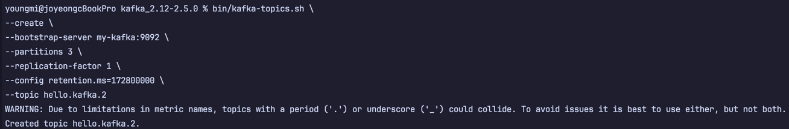

# 카프카 커맨드 라인 툴

### kafka-topics.sh
  * 토픽을 생성하거나 삭제하고, 토픽의 상세 정보를 확인할 수 있습니다.
  * 토픽(topic) : 카프카에서 데이터를 구분하는 가장 기본적인 개념, RDBMS에서 테이블과 같은 개념입니다.
  * 카프카 클러스터에 토픽은 여러개 존재할 수 있습니다.
  * 토픽은 여러개의 파티션으로 구성되어 있습니다.
  * 파티션 : 토픽의 데이터가 저장되는 물리적인 공간, 토픽의 데이터를 분산하여 저장하고 병렬로 처리할 수 있습니다.
  * 
    - `--create` : 토픽을 생성합니다.
    - `--bootstrap-server` : 카프카 클러스터의 브로커 주소를 지정합니다.
    - `--topic` : 생성할 토픽의 이름을 지정합니다.
    - 
  * 
    - `--partitions` : 토픽의 파티션 수를 지정합니다.
    - `--replication-factor` : 토픽의 복제 수를 지정합니다. ( 1 : 단일 브로커, 2 : 2개의 브로커에 복제)
    - `--config` : 토픽의 설정을 지정합니다. (ex. cleanup.policy, retention.ms, segment.bytes 등)
  * `bin/kafka-topics.sh --bootstrap-server my-kafka:9092 --list`
    - 카프카 클러스터에 존재하는 토픽의 목록을 확인합니다

