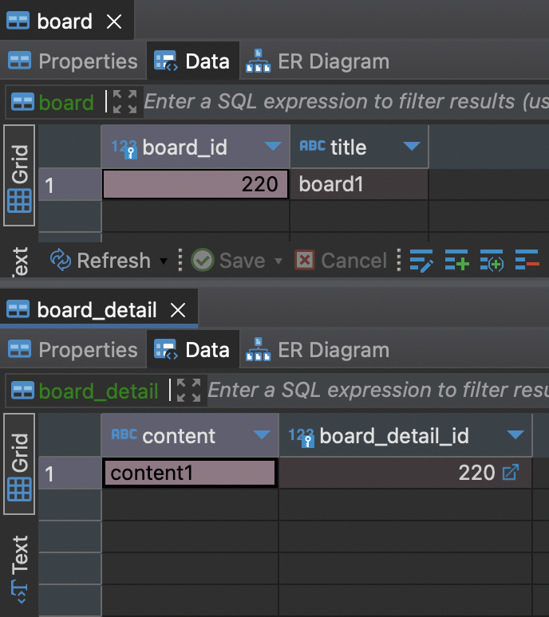

# 엔티티 하나에 여러 테이블 매핑하기

`@SecondaryTable` 을 사용하면 한 엔티티에 여러 테이블을 매핑 할 수 있습니다.

```java
@Entity
@Table(name = "BOARD")
@SecondaryTable(name = "BOARD_DETAIL",
        pkJoinColumns = @PrimaryKeyJoinColumn(name = "BOARD_DETAIL_ID"))
public class Board {
    @Id @GeneratedValue
    @Column(name = "BOARD_ID")
    private Long id;
    private String title;
    @Column(table = "BOARD_DETAIL")
    private String content;
}

//게시글 등록 & 게시글 내용 작성
Board board = new Board();
board.setTitle("board1");
board.setContent("content1");
```

- query log

    ```java
    Hibernate: 
        select
            nextval ('hibernate_sequence')
    Hibernate: 
        insert 
        into
            BOARD
            (title, BOARD_ID) 
        values
            (?, ?)
    Hibernate: 
        insert 
        into
            BOARD_DETAIL
            (content, BOARD_DETAIL_ID) 
        values
            (?, ?)
    ```


